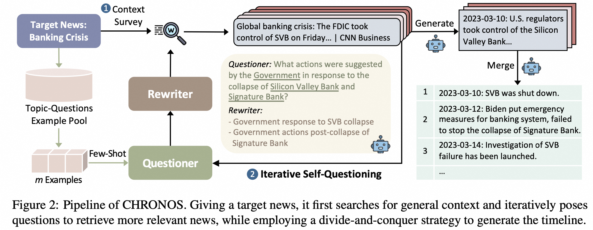

# CHRONOS: News Timeline Summarization

[](https://pytorch.org/)[](https://arxiv.org/abs/)

📑 **Paper:** https://arxiv.org/abs/2501.00888

🌏 **Chinese Web Demo:** https://modelscope.cn/studios/vickywu1022/CHRONOS


## 🚀Overview

- We propose CHRONOS, a novel **retrieval-based** approach to Timeline Summarization (TLS) by **iteratively posing questions** about the topic and the retrieved documents to generate chronological summaries.
- We construct an **up-to-date dataset for open- domain TLS**, which surpasses existing public datasets in terms of both size and the duration of timelines.
- Experiments demonstrate that our method is effective on open-domain TLS and achieves comparable results with state-of-the-art methods of closed-domain TLS, with significant improvements in **efficiency and scalability**.




## ⚗️ OPEN-TLS Dataset

We release our Open-TLS dataset for open-domain Timeline Summarization. 

The target news query is presented in `news_keywords.py` and the ground truth timeline is presented in `data/open/{NEWS_KEYWORD}/timelines.jsonl` following the below format:

```json
[["YYY-MM-DDT00:00:00", ["", "", ""]]]
```

Statistics of Open-TLS are:


## 🛠 Running CHRONOS

### Step 1. Dependencies

```bash
pip install -r requirements.txt
```

### Step 2. Exampled Questions Generation

The second step is to construct a topic-questions example pool for datasets in `data/`.

```python
python question_exampler.py
```

Or, you can use our provided `data/question_examples.json`, which contains examples for the *Crisis, T17 and Open-TLS* datasets.

### Step 3. Running CHRONOS

We have released the code of CHRONOS to complete open-domain Timeline Summarization task. You may also refer to our [modelscope repo](https://modelscope.cn/studios/vickywu1022/CHRONOS/file/view/master?fileName=app.py&status=1) to build an app with `streamlit`.

#### Replacing Keys
Before running, please replace the placeholder with your own API keys in `src/model.py` to call either Qwen or GPT models.

```python
DASHSCOPE_API_KEY = "YOUR_API_KEY"
OPENAI_API_KEY = "YOUR_API_KEY"
```

Please also replace it with your own BING Web Search API key in `src/searcher.py` to search news from the Internet. 

```python
BING_SEARCH_KEY = "YOUR_API_KEY"
```

If you want the CHRONOS to use the full page instead of only the snippet, please replace your own JINA key in `src/reader.py`.

```python
JINA_API_KEY = "YOUR_API_KEY"
```

#### Running Script

To experiment with dataset `open`, run:

```python
python main.py --model_name "$model" --max_round "$round" --dataset open --output "$output_dir" --question_exs
```

where `"$round"` is the maximum self-questioning round and `"$output_dir"` sets the output directory containing: (1) retrieved news, (2) generated timelines and (3) evaluation scores.

## 📝 Citation

```bigquery
@article{wu2025unfoldingheadlineiterativeselfquestioning,
      title={Unfolding the Headline: Iterative Self-Questioning for News Retrieval and Timeline Summarization}, 
      author={Weiqi Wu and Shen Huang and Yong Jiang and Pengjun Xie and Fei Huang and Hai Zhao},
      year={2025},
      eprint={2501.00888},
      archivePrefix={arXiv},
      primaryClass={cs.CL},
      url={https://arxiv.org/abs/2501.00888}, 
}
```

